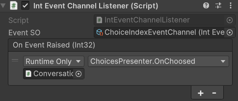

# Unity Extension Core

## Table of Contents
- [Unity Extension Core](#unity-extension-core)
  - [Table of Contents](#table-of-contents)
  - [Introduction](#introduction)
  - [Requirements](#requirements)
  - [Contents](#contents)
    - [Asset References](#asset-references)
    - [Common Utilities](#common-utilities)
    - [Editor Tools](#editor-tools)
    - [Events](#events)
      - [Action Dispatcher](#action-dispatcher)
      - [Scriptable Object Events](#scriptable-object-events)
    - [Helpers](#helpers)
    - [ObjectPool](#objectpool)
    - [Scriptable Objects](#scriptable-objects)
    - [WebGL](#webgl)

## Introduction
These are the utilities I always use as a core package when developing games with Unity.\
Feel free to use them and contribute.

I've separated the packages, with each having its own asmdef, \
so you can choose which one you want to use and import to your asmdef without needing to compile the others.

## Requirements
This package require UniTask so install it via Package Manager.\
Since I haven't found a way to install it automatically with this package...\
[UniTask Installation](https://github.com/Cysharp/UniTask?tab=readme-ov-file#upm-package) 

## Contents
### Asset References
There're many benefit from using [Addressable](https://unity.com/blog/engine-platform/addressables-planning-and-best-practices),\
and these Asset References can be used to serialize asset references in asset bundles, and let us load and unload them as needed.\
There's a generic class that can be inherited from to make a new type of asset reference:
`GeneralAssetReference<T>`\
I've added some asset that I always use and use in other packages like: [`AudioAssetReference`](https://github.com/h2v9696/UnityAudioManager), [`SceneAssetReference`](https://github.com/h2v9696/UnitySceneLoader), `SpriteAssetReference`, `ScriptableObjectAssetReference`\
**Usage:**
```
[SerializeField] private SpriteAssetReference _assetRef;
...
var asset = await _assetRef.TryLoadAsset();
// You can use asset from here
...
_assetRef.ReleaseAsset();
```

### Common Utilities
`CacheableComponentGetter`: Add this to a GameObject and its can get and cache your Component to slightly increase performance.\

### Editor Tools
`ReadOnlyAttribute`: Make a field read only (cannot be edited in inspector).

```
[SerializeField, ReadOnly] private int _state;
```

### Events
#### Action Dispatcher
Using [TinyMessenger](https://github.com/grumpydev/TinyMessenger) to create an Saga design pattern based event dispatcher.\
Usage:
Inherit from SagaBase with your own class and process your own Action, but keep in mind that a Saga should only process one type of Action.
```
public class UpdateGoldSaga : SagaBase<UpdateGoldAction>
{
    ...
    protected override void HandleAction(UpdateGoldAction ctx)
    {
        // Update gold base on ctx
    }
    ...
}
...
ActionDispatcher.Dispatch(new UpdateGoldAction(gold));
```

#### Scriptable Object Events
Use Scriptable Object (SO) as an event dispatcher.\
Usually use when you want to raise and receive event from difference scenes.\
Usage with code:
```
_intEventSO.RaiseEvent(value);
...
_intEventSO.EventRaised += ProcessData;
```
Or you can use event listener and drag your function to process data from event.\
\
Raise event SO using UnityEvent\
\
You can also inherit `GenericEventChannelSO<T>` or `GenericReturnEventChannelSO<T>` with your own data to create new event SO.\
You can do the same with `GenericEventChannelListener<T>`

### Helpers
`gameObject.GetOrAddComponent<T>()`: Get component and if it doesn't exits add it to the gameObject.\
`floatValue.NearlyEqual()`: Same as `Mathf.Approximate` but you can control epsilon.

### ObjectPool
Using UnityEngine.ObjectPool built-in to create pool manager components.\
You can inherit `BaseObjectPool<TItem>` or `BaseObjectPoolWithList<TItem>` (to expose item list which UnityEngine should do) to create your own ready to use pool.

### Scriptable Objects
`SerializableScriptableObject`: Save SO's Guid, useful when you want to save/load SO.

### WebGL
Contains WebGL utilities and plugins:
- Post message and image (using imgur) to X (twitter)
- Get Parameter from URL
- Firebase Authenticate
- Other plugins: Copy to clipboard, Hard reset browser (clear asset cache) 

...
To be updated...